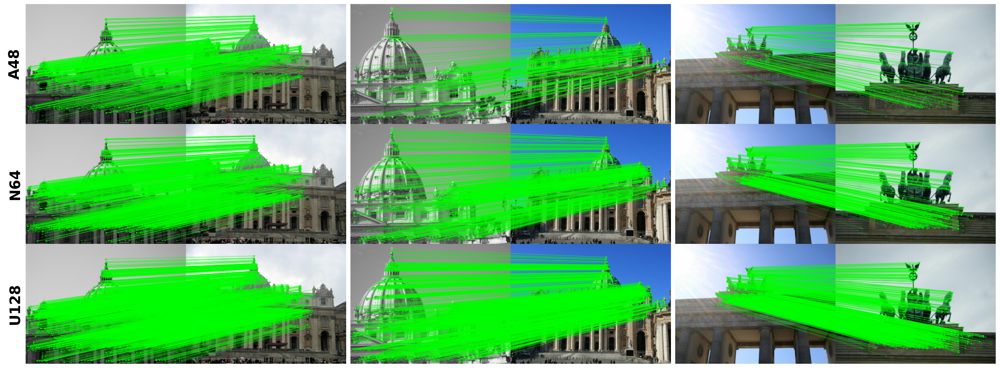

# CLIDD: Cross-Layer Independent Deformable Description for Efficient and Discriminative Local Feature Representation

We introduce Cross-Layer Independent Deformable Description (CLIDD), a high-performance local feature representation method designed for scalability. It provides a diverse range of models, from an ultra-compact 4,252 (0.004M) parameter variant to high-performance configurations exceeding 200 FPS on edge devices, delivering a robust and efficient solution for image description and matching.



## Model Zoo

Available model variants are listed below. FPS results are measured on an NVIDIA Jetson Orin-NX.

| Model | Dim | MP | FPS |
| :--- | :--- | :--- | :--- |
| A48 | 48 | 0.004 | 881.1 |
| N64 | 64 | 0.019 | 842.7 |
| T64 | 64 | 0.043 | 803.5 |
| S64 | 64 | 0.100 | 746.4 |
| M64 | 64 | 0.168 | 625.1 |
| L64 | 64 | 0.347 | 591.4 |
| G128 | 128 | 2.254 | 475.4 |
| E128 | 128 | 3.508 | 431.3 |
| U128 | 128 | 4.400 | 281.4 |

## Install Dependencies

Set up the environment by installing the required packages:

```shell
pip install -r requirements.txt
```

## Usage

Run the demo by specifying the input source and model:

```shell
python demo_seq.py [camera / PATH_TO_VIDEO_FILE] [Model]
```

Example for camera input with the A48 model:

```shell
python demo_seq.py camera A48
```

**Note:** Initial execution or significant changes in the number of points may cause brief stutters as Triton re-optimizes the kernels.
